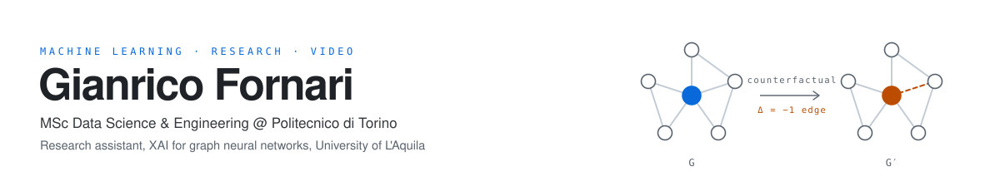

  <picture>
    <source media="(prefers-color-scheme: dark)" srcset="assets/header-dark.svg">
    
  </picture>

  
  
  
  

I like building things. Retrieval systems, data pipelines, agentic workflows, research
benchmarks, a traffic dataset that didn't exist until I started collecting it. I'd rather have a
rough working thing in front of me than a clean plan for one.

Then I want to know *why* it works. Something I can't explain isn't finished — I'll go back down
into the algorithm until it makes sense, and my projects tend to grow a measurement rig along the
way: something that tells me what's real and which part to cut.

Before any of this I spent six years as a videomaker. That's where I learned to finish.

## What I've built

**[univaq-doc-rag](https://github.com/GianFor/univaq-doc-rag)** — retrieval over 148 university
regulation PDFs. It cites the source article under every claim, and stays quiet when it isn't sure
instead of dressing up the nearest article it found. **0.875 Recall@5** on a 145-question eval set
I wrote first. Then the harness made the calls: a better embedding model, **+13.9 Recall@5**; the
cross-encoder reranker, **cut** — it lost recall at 24× the latency.

**Reverse Reconstruction** — BSc thesis, **110/110 with honours**. A benchmark that asks whether an
LLM's explanation of a graph counterfactual still contains the explanation. It usually doesn't: the
model knows what changed, then fails to say it. Three independent evaluators from three providers
agree at **r ≥ 0.977**. Now becoming a paper.

**Turin traffic** — a service on my VPS that has been swallowing the city's sensor feed every five
minutes at **93% coverage**, with a spatio-temporal GNN on top. Real data, streaming and dirty,
collected rather than downloaded.

**Agent infrastructure** — event-driven agentic workflows in production on a VPS since 2025:
stateful multi-step tasks, tool calling, webhook-triggered pipelines, all containerised. The
orchestration is written by hand, not assembled low-code.

**20,000+ users** — two years keeping the University of L'Aquila's web platforms alive and
redesigning **7 department portals** end to end: legacy PHP, production incidents, WCAG 2.1 AA.
The least glamorous thing on this list, and the one that taught me the most.

## Now

- **MSc in Data Science & Engineering**, Politecnico di Torino, 2026 → 2028.
- **Research assistant** at the University of L'Aquila — XAI for graph neural networks. Paper in preparation.
- **Open to Summer 2027 internships** — machine learning, research engineering, data engineering.

## Also true

- **Six years as a freelance videomaker and photographer.** I learned to ship on a deadline and talk to clients long before I learned to train a model.
- **gianrico.csv** — I explain AI and data science on TikTok and Instagram.
- **Elected student representative** for my degree course and for the DISIM department, Student Liaison for the EULiST alliance, and on the team that ran the EULiST Student Conference 2025 — students from 10 partner universities.

## Toolbox

  
  
  
  
  
  

  
  
  
  
  
  
  

  Turin, Italy · <a href="mailto:gianrico.fornari@gmail.com">gianrico.fornari@gmail.com</a>

